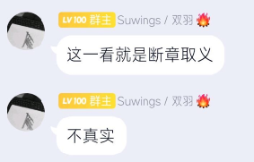
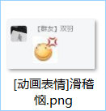
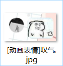

# 一、关于本项目 
项目名：`SuwingsSay - 羽录`  
此项目用于收集 `Suwings / 双羽` 在其 `MCSManager 面板用户群` 中发布的言论(越逆天越好)

# 二、项目文件规范
1.文件必须是图片格式，包括但不限于 `JPG`、`JPEG`、`PNG`、`GIF`、`BMP`、`TIFF`。  
2.文件内容请尽量短小精悍，但请不要过度删减。  
3.文件命名必须要包含全部内容，如果图片涉及到两行及两行以上的聊天内容，每条内容之间使用 `_` 来分割。  
  
4.内容必须完整，避免`断章取义`。  
  
5.如果内容中有表情包，那么文件名前应加上标记 `[动画表情]` ，后接表情包大意。  

  
6.更多内容等待后续补充。  
